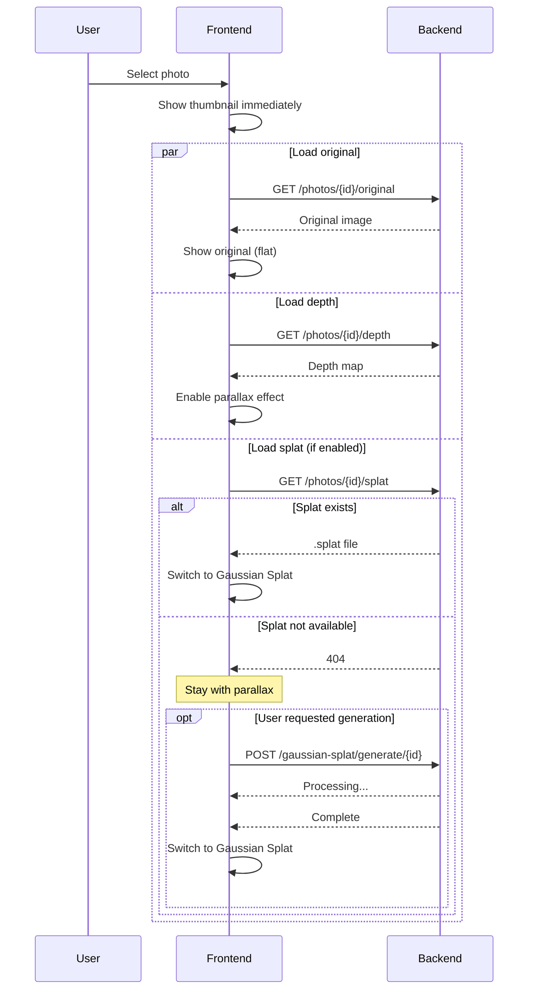
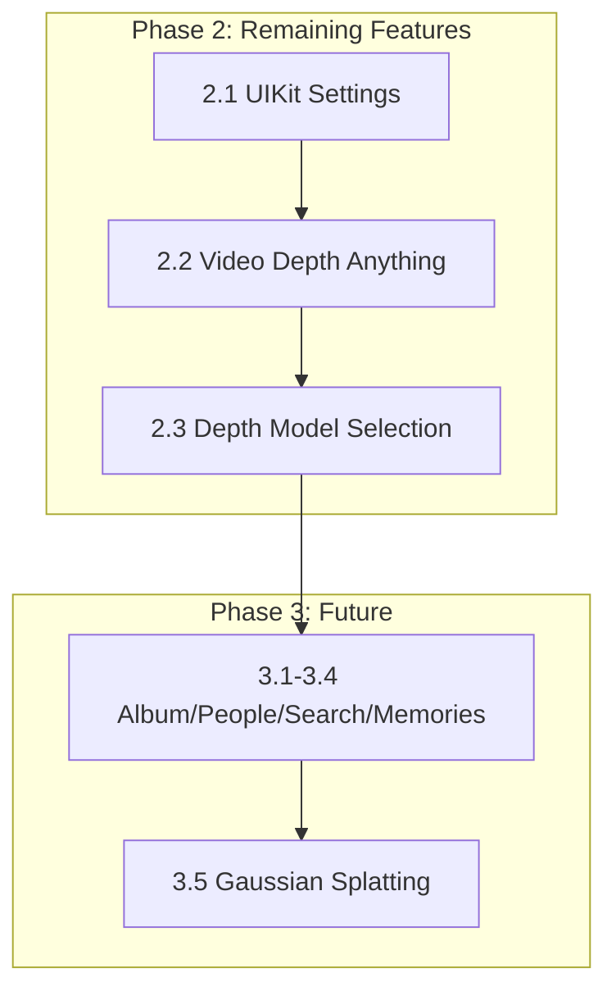

# ImmichVR Frontend Roadmap

## Overview

Refactor the frontend to provide a unified VR-first experience with a single Three.js scene, removing the redundant 2D gallery and consolidating the viewer into the main gallery.

---

## Phase 2: Core Features

### 2.1 Settings UI with @react-three/uikit ✅

**Status:** Complete | **Priority:** Medium | **Complexity:** Medium

Replace current HTML overlay settings with native VR UI using `@react-three/uikit`.

**Installation:**
```bash
npm install @react-three/uikit
```

**UI Components needed:**
- Settings panel (floating in 3D space)
- Sliders for: row width, thumbnail size, parallax intensity
- Toggle switches for: date headers, animations
- Close button

**Files to create:**
- `components/vr-ui/SettingsPanel.jsx` - uikit-based settings
- `components/vr-ui/VRSlider.jsx` - Reusable slider component
- `components/vr-ui/VRButton.jsx` - Reusable button component

**Example usage:**
```jsx
import { Container, Text, Input } from '@react-three/uikit';

function VRSettingsPanel({ settings, onChange }) {
  return (
    <Container flexDirection="column" gap={16} padding={24}>
      <Text fontSize={24}>Settings</Text>
      <VRSlider 
        label="Row Width" 
        value={settings.rowWidth} 
        onChange={(v) => onChange({ rowWidth: v })} 
      />
    </Container>
  );
}
```

---

### 2.2 Implement Video Depth Anything

**Priority:** Medium (Post-Launch) | **Complexity:** High

Replace the removed frame-by-frame approach with true temporal consistency using the `Video Depth Anything` model.

**Model:** `depth-anything/Video-Depth-Anything-Small` (or Large)

**Requirements:**
- Model loading on demand (likely heavy memory usage)
- Processing video in sequences/chunks to maintain temporal stability
- Output: Side-by-side video or depth map video stream
- UI: Progress indicator for video processing

**Files to create:**
- `services/ai/app/models/video_depth_model.py`
- `services/ai/app/services/video_service.py` (Re-implement correctly)
- `services/ai/app/routes/video.py`

---

### 2.3 Depth Model Selection

**Priority:** Medium (Post-Launch) | **Complexity:** Medium

Allow users to configure which depth model is used for generation via the settings UI.

**Options:**
- **Depth Anything V2 Small:** Fast, low memory, good edges.
- **Depth Anything V2 Base:** Balanced.
- **Depth Anything V2 Large:** Best detail (hair, fences), slower.

**Implementation:**
- Store preference in user settings (local storage or backend).
- Pass model preference to AI service when requesting depth generation.
- AI Service: Support loading/unloading models based on request or global config change.

---

## Phase 3: Future Features (Post-MVP)

### 3.1 Album Support
- Add album browser view
- Navigate between albums in VR

### 3.2 People View
- Face recognition integration
- Browse photos by person

### 3.3 Search
- Voice or text search in VR
- Filter gallery results

### 3.4 Memories
- "On this day" type features
- Special presentation mode

---

### 3.5 Gaussian Splatting Support

**Priority:** Medium | **Complexity:** High

Add optional 3D Gaussian Splatting for enhanced photo viewing with photorealistic depth.

#### Overview

Gaussian Splatting provides higher quality 3D effects than parallax depth, but requires:
- Larger file sizes (5-50MB per photo vs ~200KB for depth maps)
- Heavy ML model on backend (~2-7GB)
- Longer processing time (5-30 seconds per photo)

This feature is **opt-in** - users enable it in settings, which triggers model download.

#### Model Comparison & Selection
Research into 2025/2026 state-of-the-art single-image 3D Gaussian Splatting models:

| Model | Speed | Quality | Pros | Cons |
|-------|-------|---------|------|------|
| **Apple ml-sharp** | **<1s** | **High** | Ultra-fast, sharp geometry, metric scale, robust generalization. | Requires specific torch/cuda setup. |
| **Splatter Image** | ~38 FPS | Medium | Extremely fast, single-pass. | Limited to frontal view (frustum), less detailed back-sides. |
| **LGM (Large Gaussian Model)** | Slow | High | Good geometry, supports text-to-3D. | Heavy, multi-stage pipeline, slower initialization. |
| **DiffSplat** | Slow | High | High consistency. | Slower generation due to diffusion process. |

**Selected Solution: Apple ml-sharp**
Reasoning: It offers the best balance of **sub-second generation speed** (critical for user experience) and **photorealistic quality**. Its ability to output standard `.ply` files makes it compatible with web viewers.

#### Display Priority Chain

When viewing a photo, display the best available representation:

```
1. Gaussian Splat (.ply file)   → Best quality, full 3D, 6DOF
2. Parallax Depth (depth map)   → Good quality, 2.5D effect  
3. Original Photo               → Full resolution, flat
4. Thumbnail                    → Fallback while loading
```

```javascript
// Display logic in PhotoViewer
const getPhotoDisplayMode = (photo, splatEnabled) => {
  if (splatEnabled && photo.splatUrl) return 'splat';
  if (photo.depthUrl) return 'parallax';
  if (photo.originalUrl) return 'photo';
  return 'thumbnail';
};
```

#### Settings UI

Add to VR Settings Panel (`@react-three/uikit`):

```
┌─────────────────────────────────────────┐
│ 🎨 3D Rendering                         │
├─────────────────────────────────────────┤
│ ☐ Enable Gaussian Splatting            │
│   (Downloads ~3GB model on first use)   │
│                                         │
│ Quality: [Light ▼]                      │
│   • Light  (~5MB, faster)               │
│   • Medium (~15MB, balanced)            │
│   • Full   (~30MB, best quality)        │
│                                         │
│ [Batch Process Selected Photos]         │
└─────────────────────────────────────────┘
```

**Settings configuration:**
```javascript
// src/config/vrGallery.js
export const GAUSSIAN_SPLAT_CONFIG = {
  enabled: false,           // User opt-in
  quality: 'medium',        // 'light' | 'medium' | 'full'
  modelDownloaded: false,   // Track if model is available
  
  qualitySettings: {
    light:  { resolution: 512,  maxGaussians: 100000,  fileSize: '~5MB' },
    medium: { resolution: 1024, maxGaussians: 500000,  fileSize: '~15MB' },
    full:   { resolution: 2048, maxGaussians: 2000000, fileSize: '~30MB' },
  }
};
```

#### Backend Integration (AI Service)

**Model management:**
```python
# services/ai/gaussian_splat_service.py

class GaussianSplatService:
class GaussianSplatService:
    MODEL_NAME = "apple/ml-sharp"
    MODEL_SIZE = "~2.5GB (cached)"
    
    def __init__(self):
        self.model = None
        self.model_path = Path("/app/models/gaussian-splat")
    
    async def ensure_model_downloaded(self) -> bool:
        """Download model if not present. Returns True when ready."""
        if self.model_path.exists():
            return True
        # Download from HuggingFace or model registry
        await self.download_model()
        return True
    
    async def generate_splat(
        self, 
        image_path: Path, 
        quality: str = "medium"
    ) -> Path:
        """Generate .splat file from single image."""
        config = QUALITY_CONFIGS[quality]
        # Run inference
        splat_data = self.model.predict(image_path, **config)
        # Save to .splat format
        output_path = image_path.with_suffix('.splat')
        splat_data.save(output_path)
        return output_path
```

**New API endpoints:**
```python
# POST /api/gaussian-splat/enable
# Downloads model, returns progress updates via SSE

# POST /api/gaussian-splat/generate/{photo_id}
# Generates splat for single photo (on-demand)

# POST /api/gaussian-splat/batch
# Body: { photoIds: string[], quality: string }
# Queues batch processing

# GET /api/photos/{photo_id}/splat
# Returns .splat file if available, 404 if not
```

#### Storage

Store `.splat` files alongside Immich data:

```
/immich-data/
  thumbnails/
    {photo_id}.webp
  depth/
    {photo_id}_depth.png      # Existing depth maps
  splats/
    {photo_id}.splat          # New: Gaussian splat files
    {photo_id}_light.splat    # Quality variants (optional)
    {photo_id}_medium.splat
    {photo_id}_full.splat
```

#### Thumbnail Badges

Show availability indicators on gallery thumbnails:

```javascript
// Badge component for thumbnail overlay
function AvailabilityBadge({ photo }) {
  return (
    <div className="badges">
      {photo.splatUrl && <span className="badge splat">3D</span>}
      {photo.depthUrl && <span className="badge depth">D</span>}
    </div>
  );
}
```

Visual design:
```
┌──────────────┐
│              │
│    Photo     │
│              │
│         [3D] │  ← Green badge: Splat available
└──────────────┘

┌──────────────┐
│              │
│    Photo     │
│              │
│          [D] │  ← Blue badge: Depth only
└──────────────┘
```

#### Frontend Rendering

Use `@mkkellogg/gaussian-splats-3d` for WebGL rendering:

```javascript
import * as GaussianSplats3D from '@mkkellogg/gaussian-splats-3d';

function GaussianSplatViewer({ splatUrl, position, scale }) {
  const { scene, camera, gl } = useThree();
  const viewerRef = useRef(null);

  useEffect(() => {
    const viewer = new GaussianSplats3D.Viewer({
      scene,
      renderer: gl,
      camera,
      useBuiltInControls: false,
      selfDrivenMode: false,  // We control rendering
    });
    
    viewer.addSplatScene(splatUrl, {
      position,
      scale: [scale, scale, scale],
      showLoadingUI: false,
    });
    
    viewerRef.current = viewer;
    
    return () => viewer.dispose();
  }, [splatUrl]);

  useFrame(() => {
    viewerRef.current?.update();
  });

  return null;
}
```

#### Progressive Loading Flow



#### Dependencies

```json
{
  "@mkkellogg/gaussian-splats-3d": "^0.4.x"
}
```

#### Implementation Phases

1. **Backend model integration** - Add splat generation to AI service
2. **Storage layer** - Add splat file management
3. **Settings UI** - Enable/disable toggle, quality selection
4. **Frontend renderer** - Integrate GaussianSplats3D
5. **Progressive loading** - Fallback chain implementation
6. **Batch processing** - Queue UI and background jobs
7. **Thumbnail badges** - Visual indicators

---

## Implementation Order



**Estimated effort:**
- Phase 1 (Cleanup): ~1-2 days
- Phase 2 (Core): ~3-5 days
- Phase 3 (Future): TBD

---

## Technical Notes

### Dependencies to Add
```json
{
  "@react-three/uikit": "^0.x.x",
  "@react-spring/three": "^9.x.x"
}
```

### Files to Delete
- `TimelineGallery.jsx`
- `VRGallery.jsx`
- `Gallery.jsx`
- `FallbackGallery.jsx` (if unused)

### Key Configuration Constants
```javascript
// New config file: src/config/vrGallery.js
export const VR_GALLERY_CONFIG = {
  // Viewer
  adjacentPhotosCount: 2,
  animationDuration: 0.5,
  
  // Parallax
  parallaxIntensity: 0.1,
  depthTransitionDuration: 0.5,
  
  // Gallery
  thumbnailSize: 1.0,
  rowWidth: 8,
  backgroundColor: '#000000',
};
```
